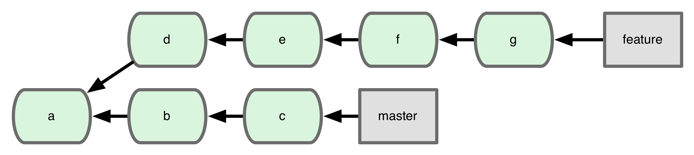
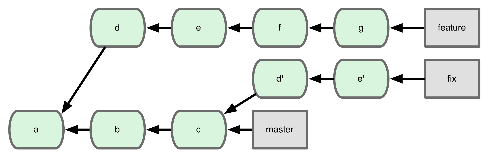
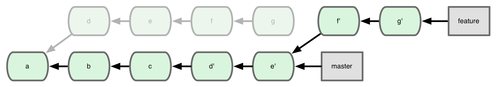

> Travel through time with Git

> # Change the Past

> Of all the things Git can do, perhaps one of the most feared is the ability to rewrite history.

The amount of control git gives to its users is what sets it apart from other version-control systems.
Users of Subversion or Mercurial, where history is permanent and immutable, generally have two reactions upon discovering the `rebase` command: horror that such a thing even exists, and confusion as to why anyone would want it in the first place.

## Why do I want this?

If you've spent much time working on software, you've probably been in at least one of these situations:

* You're working on a feature, but find yourself with two chunks of work that should be separate.
* You forgot to delete a file, and a two-line bug fix got spread across 3 commits.
* You had to make a new commit that *only* undoes some changes introduced in a previous commit.
* You started working on a bugfix, which later turned into a deploy-it-yesterday hotfix.

Rebase can help you solve these problems, or avoid them entirely.
It's much like using a word processor instead of a typewriter - you can edit your story and fix problems before sending it to the printer.

It's easiest to think about this by seeing it in action.
Let's look at a couple of examples.

*[
A note on diagrams: green blocks are commits, and their arrows indicate "parenthood", so they point backward in time.
The gray blocks are branch refs, and their arrows indicate the commit they refer to.
Blue blocks are remote refs.
]*

## A trivial example

In this example, the `master` branch (which is shared with the whole team) and your own personal `experiment` branch (which only exists on your machine) have diverged somewhat.


Let's suppose that, for whatever reason, you don't want a merge commit.
Rebase allows you to bring in the changes from the `experiment` branch while keeping the history linear.
Here's how to make that happen:

```sh
$ git checkout experiment
$ git rebase master
```

And here's what the history looks like afterward:


It helps to think of commits as **a collection of changes** rather than a series of fixed versions.
The `c` and `d` commits have been re-made as `c'` and `d'`, such that their *changes* are applied on top of `f`.

## A slightly less trivial example

Let's say you were working on a bug fix, but it turns out to be more urgent than you first thought.
Here's what your history looks like right now:


You started your fix on the `development` branch, where all new feature work goes.
Meanwhile, the `deployed` branch has had a couple of small fixes applied to it.
Now you discover that your fix corrects a critical issue, and you want to deploy it to production, but without all the half-finished features in `b` and `c`.
Rebase to the rescue!

```sh
$ git rebase --onto deployed development fix
```

The syntax is `--onto <new-base> <old-base> <end>`.
In this case, we want all the changes starting after `development` and ending with `fix` to be replayed on top of `deployed`.
Here's what it looks like afterward:


## Conflicts

At its heart, rebase is a merge operation, which inevitably means merge conflicts.
The good news is that rebase actually makes it easier to deal with them!

When you do a standard `git merge`, you have to resolve all the conflicts at once.
If your branches have been separated for a while, this can be a daunting task; dozens of conflicts, scattered through your codebase, only some of which are related to each other.
It's the kind of situation that make developers run screaming from their keyboards.

Rebase, on the other hand, applies commits one at a time.
If any of them conflict, you get to review them as they're applied, and correct the problems.
If it gets to be too much, you can always change your mind: `git rebase --abort` resets your repository back to how it was before it started.

## Interactivity

You could also think of rebase as a scripted series of invocations of `git cherry-pick`.
In fact, there's a way to edit the script before it runs.
Typing `git rebase --interactive` (or the shorter `-i`) drops the rebase script into your text editor:

```txt
pick 6ad9071 Work on feature ABC
pick 5742a11 Fix bug #24
pick fd68d8d Work on feature DEF
pick a4806b0 Fix makefile

# Rebase 83b50a7..a4806b0 onto 83b50a7
#
# Commands:
#  p, pick = use commit
#  r, reword = use commit, but edit the commit message
#  e, edit = use commit, but stop for amending
#  s, squash = use commit, but meld into previous commit
#  f, fixup = like "squash", but discard this commit's log message
#  x, exec = run command (the rest of the line) using shell
#
# These lines can be re-ordered; they are executed from top to bottom.
#
# If you remove a line here THAT COMMIT WILL BE LOST.
#
# However, if you remove everything, the rebase will be aborted.
#
# Note that empty commits are commented out
```

Notice how git helpfully documents what you can do.
The top few lines are the rebase script, which you have control over.

This is where rebase's power really shines through.
You can remove commits that you don't want, introduce new ones, or squash commits together where it makes more sense to have just one.
You can change commit messages, or even the contents of the files committed.

This is more than just aesthetics; it becomes even more useful when combined with other git features.
Many projects have the policy that all commits should pass the unit tests.
This allows `git bisect` to be very useful for finding when problems were introduced.
It also comes in handy with `cherry-pick` – extracting an atomic feature into just one commit allows it to be portable to another branch.

## A Non-trivial Example

Suppose you're working on a feature using a branch, and it's a ways from being finished.
But you notice that part of what you've done is actually a completely separate fix, that the rest of the team needs right now.



You can use rebase to merge the "accidental" fix into master, while keeping the in-progress feature separate.
Let's suppose that commits `e` and `f` contain this fix.
First, we create a new branch to hold the fix:

	$ git checkout -b fix

Next, we use an interactive rebase to keep only the commits related to the fix, and change it so they apply on top of `master`:

	$ git rebase -i master

Here's what we have so far:



Now we can merge the fix back into master, and rebase our feature on top of it:

	$ git checkout master
	$ git merge fix
	$ git checkout feature
	$ git rebase -i master

We use an interactive rebase to remove the old `e` and `f` commits.
Here's the end result:



## It's really not that scary

The biggest worry people have when they learn about this feature is that they'll screw up.
Relax; it's going to be fine.
Looking at the diagrams above, you may notice that the original commits aren't gone, they're just harder to see.

Nothing is ever truly lost in a Git repository.
History is built out of commits (which are immutable) and refs or branches (which change all the time).
Almost every invocation of rebase will move a branch around, but the underlying commits are still in the repository.

Try this in any repository you've been working in:

	$ git reflog my_feature

You'll see a listing of every commit that branch has pointed to.
There's an entry in the log for every commit you've ever made on your machine.
It'll look something like this:

	8672898 my_feature@{0}: rebase finished: refs/heads/my_feature onto <sha>
	7b47989 my_feature@{1}: commit: Fixed #7294
	c6cb71b my_feature@{2}: clone: from http://url.to/origin/repo

The lines are in reverse date order; newest at the top.
The first line shows the most recent change: a rebase.
Undoing the rebase is usually as simple as this:

	$ git reset --hard my_feature@{1}

Also keep in mind that all of these operations **only affect the repository on your machine.**
None of the changes rebase is making are shared with anybody else until you decide to share them.

## Publicity

One simple guideline will save you from worlds of pain: **only change history that has never left your machine.**
If you've added 10 commits since you pushed, try to keep your rebasing to only those 10 commits.
Git helps you with this; if your push would overwrite history on the origin, it helpfully warns you:

	$ git push
	To https://url.to/origin/repo
	 ! [rejected]        master -> master (non-fast-forward)
	error: failed to push some refs to 'url.to/origin/repo'

A simple `git push -f` will get around this, but the warning should be enough to keep people from making mistakes.

Still, there are some situations where you *do* want to change history that exists elsewhere.
One example is the removal of sensitive information from a repository.
Let's walk through an example.
Here's some simple history:


Let's say that the `c` commit contains a server password, and simply adding a new commit that deletes that line won't do, you want it to have never existed in the repository.
So you do an interactive rebase, and remove the offending commit:


You make sure the new history is pushed to origin:

	$ git push -f origin master

And you send an email to your team, explaining what happened, and what they should do to adjust.
Your teammate Jill has some work that was based off of the old `master`:


Here's what it looks like after a `git fetch`:


So she has to rebase her work onto the new head of the history:

	$ git rebase --onto origin/master master~ master


Your teammate Bill has it easier; his `master` doesn't have any extra commits on it:


So all he has to do is change his `master` branch to point to `origin/master`:

	$ git reset --hard origin/master


## Fin

By now it should be clear that this isn't just another feature.
It's transformative, and changes the way you relate to version control.

VCS tools used to be write-only, like a typewriter – once the ink hit the paper, the only options you had were to keep typing or throw the page away.
The ability to rebase is like getting a text editor.
Now you can fix typos, check your spelling, and even restructure entire documents before it becomes permanent.
Now your history is rewritable, and you have the power to make it better.

Rebase isn't without its downsides, though.
It can help make the history more linear and understandable, but it also erases the messiness, the record of *what actually happened* while the software was being developed.

No matter which side of this debate you come down on, the good news here is that **you** are the one in charge of your history. 
Do you want periodic merges in your log, or do you prefer it to be linear?
Do you want an accurate history of what happened, or an idealized legend of correct actions?
It's entirely up to you.

**TODO:** references